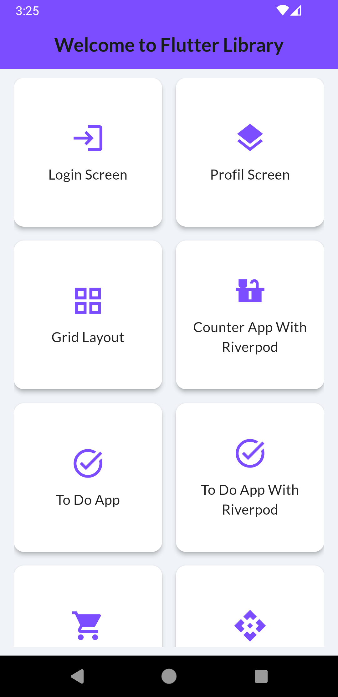

# 🚀 Flutter Learning Library

Welcome to the **Flutter Learning Library**! This repository is designed to help beginners and enthusiasts start their journey with Flutter and enhance their skills through hands-on examples and tutorials.
<p align="center">
  
</p>

## 🌟 What's Included?

This library covers essential Flutter topics and provides real-world examples for building powerful mobile applications:

1. **Basic UI and Layouts**
   - Explore Flutter's UI system and learn how to build stunning layouts using widgets.
  
2. **State Management**
   - Master the most popular techniques for managing state in your apps, including Provider and Riverpod.

3. **Networking and API Integration**
   - Learn how to fetch data from APIs and integrate it into your Flutter apps.

4. **Animations and Custom UI**
   - Add flair to your apps with custom animations and engaging UI components.

## 🖼️ App Previews
**📱 Weather App**
A simple weather app that displays the current weather conditions, temperature, and forecast using a beautiful animation.
<p align="center">
  
</p>

**✅ ToDo App**
A to-do list app that allows users to create, edit, and delete tasks. It demonstrates basic state management and user interaction.
<p align="center">
  
</p>

## 🛠️ Features in Progress

This repository is continuously being updated. Future updates will include:
- Additional advanced state management techniques
- More complex API integrations
- Further customization of UI components and animations
- Sample apps to illustrate the concepts

Stay tuned for more!

## 📥 How to Get Started

1. **Clone the repository:**

   ```bash
   git clone https://github.com/Hamza-Maa/-Flutter-Learning-Library.git
   ```

2. **Open the project in your favorite IDE:**
   - Make sure you have Flutter and Dart installed on your machine.

3. **Run the examples:**
   Each folder contains its own app or example. Navigate to the desired example and run:

   ```bash
   flutter run
   ```

4. **Refer to the detailed PDF guide included in the repository** for step-by-step instructions on each example.

## 📚 Documentation

A comprehensive PDF is also available to guide you through the concepts in more detail.

## 🤝 Contributions

Feel free to contribute! If you have any suggestions or want to add more examples, please submit a pull request or open an issue.

## 📬 Contact

For any inquiries, feel free to reach out via [LinkedIn](https://www.linkedin.com/in/hamza-maatougui/) or raise an issue on GitHub.

---

**Happy coding! 🚀**

